# Trip Analyzer
The Unbiased & Interactive View of Tourism Data to Tourists for Making Informed Decisions


## ABSTRACT

_Making sense of the vast amount of online digital data is always challenging, even more so
when a tourist starts planning her/his next vacation. Travel web-sites and social media
forums either have commercial interests or biased personal opinions presented as advice or
recommendations. Our solution provides prospective tourists with information collected
from government, commercial and social data sources and presents it through a unified
interactive web-based graphical interface._

## 0. INSTALLATION AND EXECUTION
Trip Analyzer is a web-based application built with the help of D3. The package contains all necessary source code and aggregated data for setting up the application locally. The setup of application will be divided into two parts as 1) web server on Apache with PHP5 support and 2) database on MySQL v5 or above, with the files stored under folders Application and Dataset respectively. 

Web server and Database can be set up by installing XAMPP so Apache with PHP support and Mysql are ready.

### 0.1 Database

Local Mysql database can be accessed through phpMyAdmin (installed in XAMPP) or any other client (eg, Workbench). 

To prepare the database of Trip Analyzer:

- run query, CREATE DATABASE `trip.analyzer` 
- execute CODE\Dataset\trip.analyzer.sql to import data into created database `trip.analyzer`

Next the db info of web application should be changed in **CODE\Application\include\db_info.php** with variable `$username`, `$password`, `$host` set to access the local database. 

	$username = "tutorial_user"; 
	$password = "12341234";   
	$host = "mytestdb.dummy.us-east-1.rds.amazonaws.com";

### 0.2 Web Server

Configuration shall be done as follow:

- In httpd.conf, modify `DocumentRoot` pointing to **CODE\Application**.
- In php.ini, this line should be present. (if the line is commented by prefix semicolon, uncomment it) 

```
extension=mysqli
```
	

Make sure port 80 is open on the server.

### 0.3 Execution

Open Firefox for best support in D3, direct to http://localhost to access Trip Analyzer locally.

On the landing screen, select preference of your trip - Travel Style, Budget per day (in USD), Density, and Purpose. Submit will show you the top 20 matching result. The world map will show you the affordability on each country. Clicking bubbles will show you insights on each destination. Presented data includes:

Right Section:
- Ranking of suggested cities matching input criteria
- Cities' POI count and suggestion

Bottom Section:
- Average Temperature
- Average Precipitation
- Air Quality Index
- Word Cloud

Tooltip:
- Reddit Review Index and Happiness Index
- Price Index
- Crime Rate and Travel Warning

To rerun, hit the URL again or reload on browser.

## 1. INTRODUCTION

Tourism is one of the fastest growing industries impacting multiple socio-economic
dimensions such as transportation, hospitality, local arts and craft and related e-commerce.
Any individual can be classified as tourist when she/he voluntarily leaves normal
surroundings of residence to visit another environment. The internet has had a major impact
on tourism both for the service providers and the consumers. Tourists today have access to a
vast amount of digital information distributed across the internet on commercial, public and
government travel-websites, social media-websites and personal or public blogs/forums.

With the world getting smaller by the internet, travelling around the world is also getting
much easier. Although many trip planner applications are available freely, there is a lack of
approaches in unbiased data visualization. Our objective is to collect information through
various sources and provide interactive view of the data to tourists that is customizable to
their personal preferences.


### 1.1 Motivation

The primary motivation driving our solution is that every tourist is different and different
factors such as travel/vacation budget, tourist density, crime rate, safety, pollution levels,
number of attractions, social sentiments etc. weigh differently for each. Thus, **our solution
does not give travel recommendations** but provides an unbiased interactive visual snapshot
of travel related information allowing the tourists to shortlist travel destinations based on
their personal preferences.

## 2. PROBLEM DEFINITION

There are two major challenges that tourists currently encounter while planning their next
vacation. First being that information on different travel destinations is distributed all over
the internet with no single unified view. Secondly, the tourist websites although provide an
overview of the travel destinations, the information is modelled to favour the underlying
commercial interests.

Our solution intends to provide tourists a unified tourism related data through a visual and
interactive interface. Through a web interface the data available freely across government
websites, social forums and free commercial APIs is aggregated to create a holistic view of
the information subdivided into six major categories viz, tourist attractions, overall travel
budget, tourist’s personal preferences, social media sentiments, seasonal tourist density and
government/publicly issued travel advisories. The simple visual interface allows tourists to
quickly peruse a large amount of information and shortlist possible travel destinations for
their next vacations based on their personal preferences.

## 3. RELATED WORK

### 3.1 Internet’s Impact on Tourism

After proliferation of Internet usage, travel and tourism section has seen dramatic changes in
its business model [1][2] and also in the form of user generated travel contents through blogs
and review [5][6]. The consumer has access to travel related information, competitive price
offers while sitting in the convenience of her/his home. The downside of this convenience is
the biased view of the data presented by these commercial sites based on consumer behaviour
[3].

### 3.2 Big Data Analytics

Tourists today do not want to be a passive consumer; they seek for the co-creation and
personized services. Big data analytics allows to push classic electronic consumer
relationship management into new levels [7] [8] [9].


Ping et al. [10] proposes tourism demand forecasting hybrid system combining FCM
clustering method with logarithm least-squares support vector regression with genetic
algorithms (LLS-SVRGA).

Ulrich et al. [11] presents a comparison of predictive accuracy between univariate and
multivariate models. While another method [12] proposes an ANN-based forecasting method
named C-C-ANN that considered the sequence patterns and near characteristics of a data
series.

Woodside et al. [13] explores relationship between values and holiday preferences through
questionnaires. The result shows correlations between individual values and types of
destinations. The finding is useful to us in providing an evidence in the connection between
user characteristic and holiday preference. Joshi et al. [14] describes a travel system meeting
tourism need in India.

Stefanidis et al. [15] introduce the paradigm shift in the Web from a document-centric
infrastructure to an entity-centric organization of data. In a recommendation system, entity-
centric data is required.

Lim, K.H., Chan, J., Leckie, C. et al. [16] present in their paper same problem set as our
project but in a different approach. Their paper is focused on concepts of ideas and
implementation of recommendation algorithm, while our project will mostly focus on data
collection and visualization.

### 3.3 Social Media and Tourism

Matsuo et al. [17] proposes two ideas for tourism informatics, which inspires the constitute
of our project backend system. We utilized social platform Reddit, extracting tourist
information through its community, comment, and voting, to deduce the popularity and
potential target audience.

Teare, Richard et al. [18] highlights the importance of the use of user-generated content from
social media from the aspects of millennials growth, mobile’s popularity, dynamic pricing
and marketing shift. We looked at statistic data from officially recognized international
source to avoid commercial leaning and World Bank is the major source of our data.

### 3.4 Multisource Data Linking

Karapiperis et al. [19] present summary of SkipBloom, BlockSketch and SBlockSketch
methods for record linkages. Mamun et al. [20] present an efficient record linkage algorithm
using complete linkage clustering. For our solution we implemented a simple rule based
deterministic record linkage for combining multiple data sources.


## 4. PROPOSED METHOD

### 4.1 Intuition

Current tourism websites are information systems where users have to read and consolidate
information from different sources in order to make an informed decision. These websites,
although account for personal preferences, introduce commercial bias when making
recommendations. They also tend to introduce a small bias towards the preference of people
who are more likely to be vocal on such platforms.

Our solution relies on two simple premises, that every tourist is different and if presented
with relevant information in a simple graphical interface, without any commercial bias,
tourists can intuitively decide on a travel destination that is closest to their personal
preferences.

### 4.2 Why should it be better?

As stated earlier, travel information or planning sites usually tailor raw data to achieve
commercial profits while the unbiased sources of information such as wiki, WHO, World-
Bank etc do not provide a single consolidated view or interface. Our solution intends to fill
this void by collating following government/public data collected through World Bank,
GoogleQuery, local weather stations, Reddit etc and presents it through an interactive visual
interface:

- Tourist attractions
- Tourist density
- Consumer Price Index
- Weather conditions
- Transportation Index
- Crime Rate Index
- Tourist Safety levels
- Pollution/Air quality levels
- Reddit sentiment analysis score
- WordCloud on tourist reviews

#### 4.2.1 Innovations

- Currently no other tourism related solution provides such unified view of information
    distributed across several public/government databases
- Unlike Wiki (Voyage), our solution provides data in an interactive graphical interface
- Multiple indexes are scaled and baselined for easier user appreciation
- Sentiment analysis of user comments on reddit is presented as positive/negative
    sentiment percentage eg., _Paris [79% positive, 21% negative]_
- WordCloud gives user a quick snapshot of high frequency keywords related to a
    chosen city


## 5. APPROACH

### 5.1 Obtaining Raw Data

**5.1.1** The World Bank provides free access to a large number of reliable databases and thus
was selected as primary data source for following information:

- Tourist density (low, medium, high) based on the arrival/departure of number of
    tourists
- Consumer Price Index based on tourists’ spot expenditure data along with regional
    price index
- Average temperatures and weather conditions based on historical data

**5.1.2** The Numbeo is the world’s largest database of user contributed data about cities and
countries and was selected as data source for following information:

- Crime Rate Index based on number and nature of crimes reported across the cities
- Safety Level Index based on number and nature of crimes reported against the tourists
    across the cities
- Transportation Index based on availability, ease of travel and cost of traveling through
    public transportation in the city

**5.1.3** The real-time air quality and city’s pollution level data is obtained through APIs
provided by aqicn.org for data obtained from AirParif - Association de surveillance de la
qualité de l'air en Île-de-France.

**5.1.4** The Sygic agreed to provide API access for the purpose of student project for a limited
period (Jul 2019). This acts as basis for all the information related to list of tourist attractions
in following broad categories:

- Discovering
- Eating
- Nightlife
- Outdoors
- Family
- Relaxing
- Shopping
- Sightseeing
- Sports

**5.1.5** The Google BigQuery cloud public dataset for Reddit comments since 2015. The
dataset is over 250Gb and was first filtered on ‘Travel’ subreddit to get around 15 million
user comments. This was then used for location based sentiment analysis and frequency
based WordCloud of popular keywords.


**5.1.6** The request for API access for hotels, flights etc to several service providers was
rejected since the access was only available for commercial purposes and thus not included
in the scope of our solution.

### 5.2 Algorithms

#### 5.2.1 Data Pre-Processing and Multisource Data Association

The data obtained from public data sources is not free from errors and inaccuracies and thus
requires pre-processing to improve data quality. The pre-processing was also required to
scale various indexes to a common scale for easy of interpretation. The data pre-processing
was carried out using R data libraries while the real-time data is processed using JavaScript.

To integrate heterogenous data from multiple sources a simple **deterministic record linkage**
algorithm was implemented in R and data was added to a common database with city code
as the primary key.

#### 5.2.2 Sentiment Analysis and WordCloud

- Data Source: Google BigQuery Reddit dataset
- Data Size: ~250 Gb
- Total records: ~15 billion
- Records in “Travel’ subreddit: ~1.5 million

Due to large size of the dataset, sentiment analysis was carried out offline using ‘Tidy Text’
package in R with AFFIN lexicon for top 100 tourist destinations. The score for each country
was scaled to percentage positive/negative comments.

WordCloud for high frequency keywords appearing in the user comments for each city was
also created offline using ‘Tidy Text’ package in R.


### 5.3 Web Interface

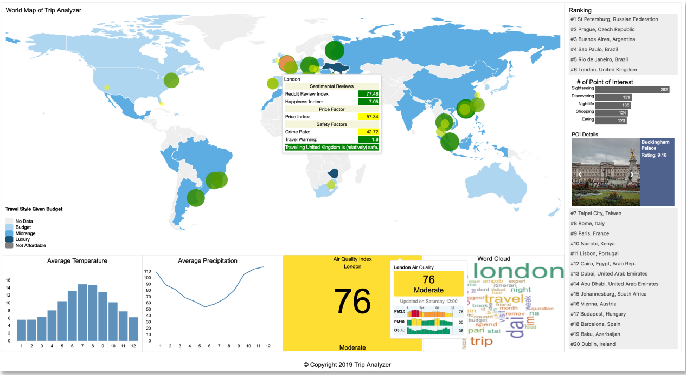
<p>Fig 1. Interactive user interface of Trip Analyzer presented through a website hosted online on Amazon Web Services</p>


|<p>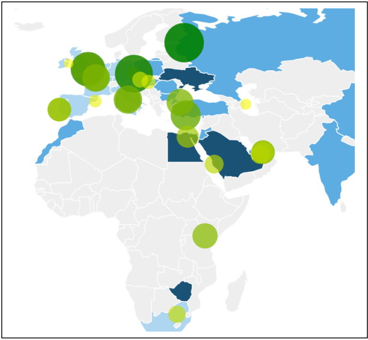</p><p>Fig 2. Landing page highlights locations based top-level user preferences</p>|<p>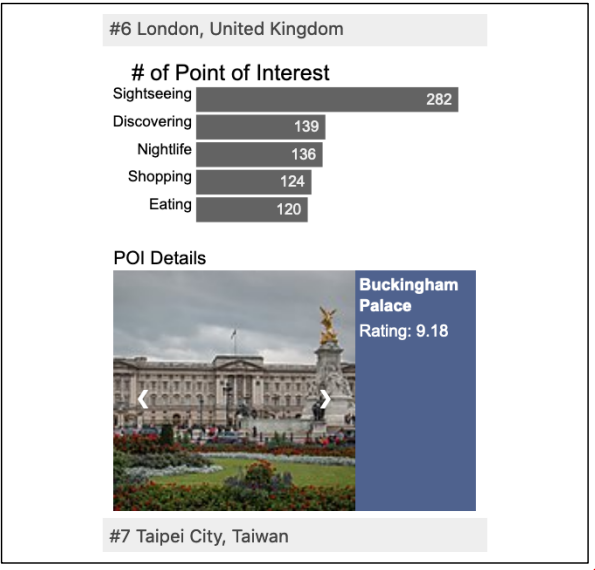</p><p>Fig 3. The attraction score is based on number of tourists attraction matching with the user’s preferences.</p>|
| ----------- | ----------- |
|<p>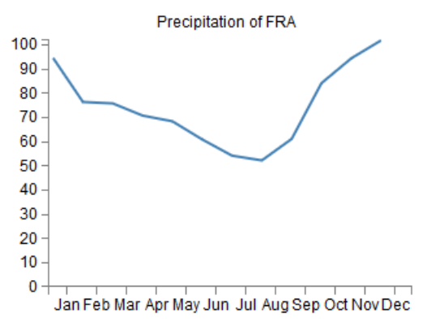</p><p>Fig 4. The weather data received from World Bank datasets.</p>|<p>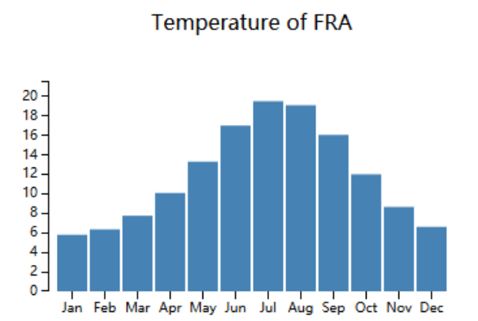</p><p>Fig 5. Realtime air quality data for the selected city</p>|
|<p>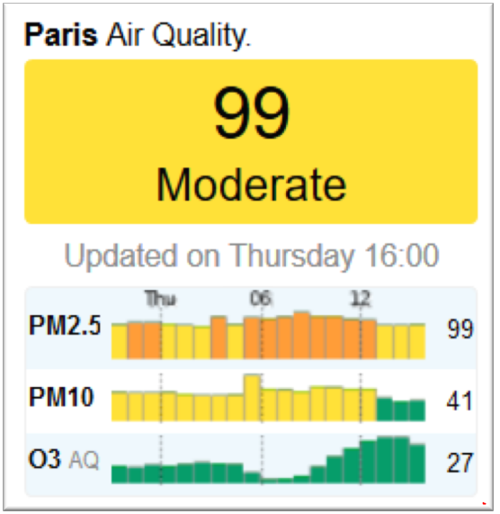</p><p>Fig 6. The temperature data received from World Bank datasets.</p>|<p>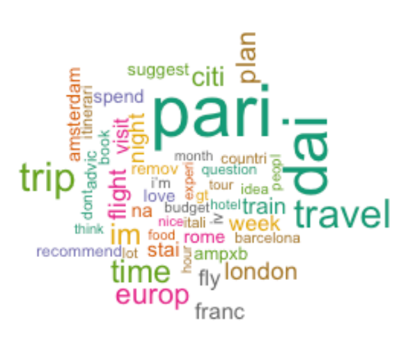</p><p>Fig 7. WordCloud with high frequency word roots appearing in Travel SubReddit user comments</p>|

#### 5.3.1 Website Hosting (in our testing) - Amazon Web Services

||Web Server|Database|
| ----------- | ----------- | ----------- |
|# of CPU|1|1|
|RAM|1GB|1GB|
|Memory|30GB|20GB|
|Package|Php7.2/ Apache HTTP Server|MySQL5.2|
|Host|ec2-3-210-52-157.compute-1.amazonaws.com|mytestdb.cen3rhkl2zlv.us-east-1.rds.amazonaws.com|

#### 5.3.2 Libraries for Dynamic Data Driven Documents

- D3 JavaScript library v5 for interactive web interface
- DataMaps library – customizable SVG map visualizations

### 6. EVALUATION

Our measure of success focused on the voice from outside. We divided the project evaluation
from volunteers and external users in three distinct stages:

- Stage 1: Preliminary user preferences survey [50 volunteers]
- Stage 2: Midterm user review of the draft version of our solution [10 volunteers]
- Stage 3: User review of the final version of our solution [10 midterm + 5 new
    volunteers]

#### 6.1 Preliminary User Preferences Survey

This survey was carried out during the initial design stage by distributing a set of
questionnaires to limited number of volunteers. The aim of this survey was to identify relative
importance of factors or preferences to a tourist while planning their vacations.

**_The results from the preliminary survey were used in deciding the information to be
included in our solution._**

##### 6.1.1 Questionnaire
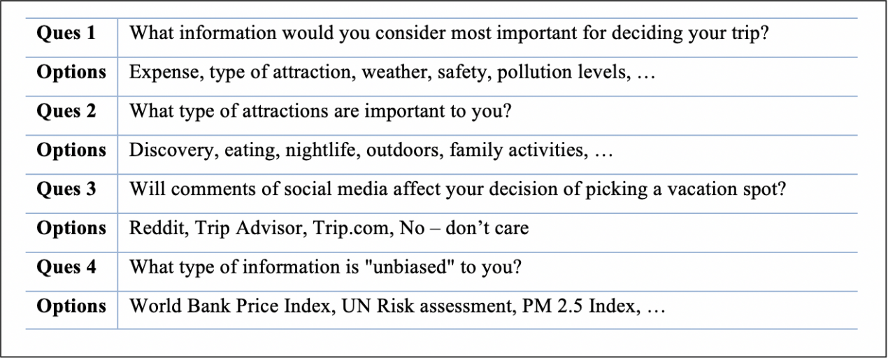
Fig 8. List of questions and options for preliminary user preference survey

##### 6.1.2 Survey Response Statistics
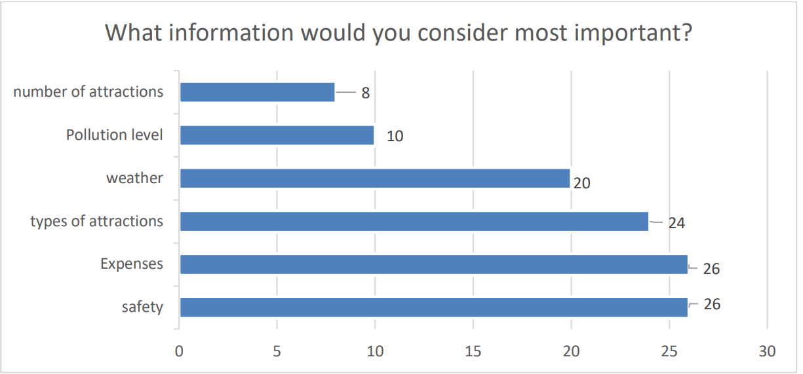
Fig 9. Survey response for effect of social media while deciding a vacation that is considered most important during planning a vacation

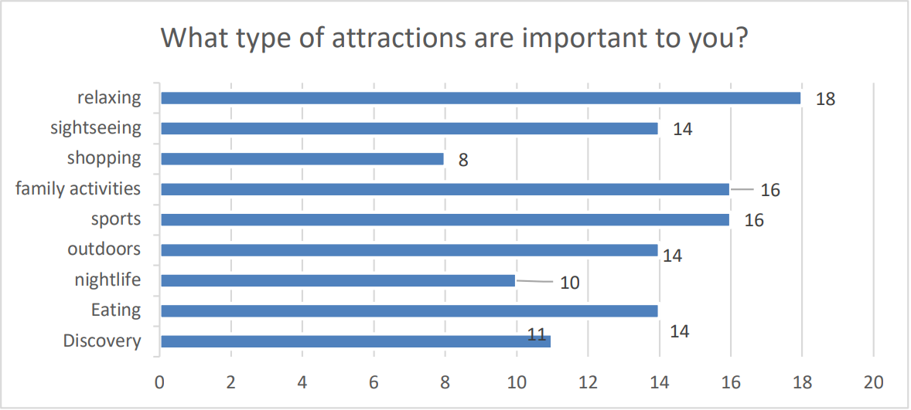
Fig 10. Survey response for type of attractions that are most important during vacations

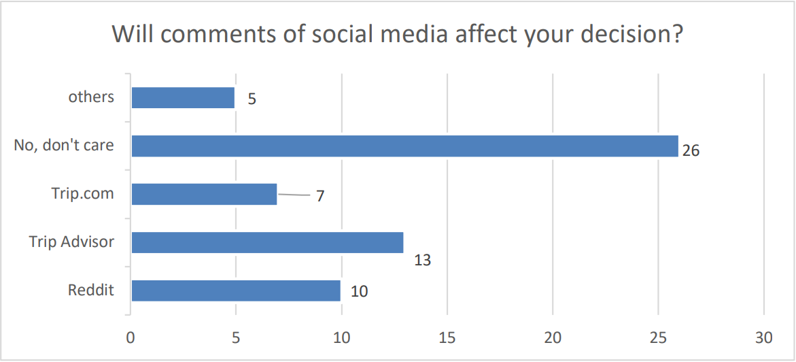
Fig 11. Survey response for effect of social media while planning a vacation

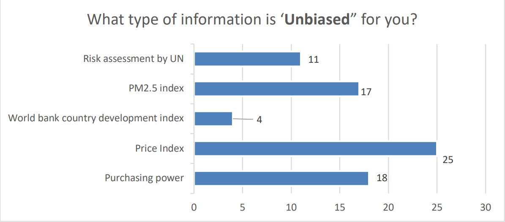
Fig 12. Survey response for information related to tourism that is considered as unbiased

#### 6.2 Midterm User Review

The draft version of our solution was shared with 10 volunteers for review along with a
simple questionnaire. The survey questions were designed for user to evaluate destinations
shortlisted through our solution against their previous vacation.

**_The result from the mid-term review gave us an estimate of the usability of our solution
and changes to be made in the final version._**


##### 6.2.1 Questionnaire

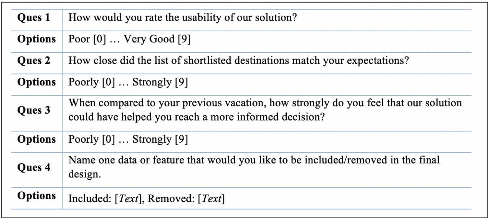
##### Fig 13. List of questions and options as part of Midterm Survey

#### 6.2.2 Midterm Survey Response Analysis
- An average usability score of 5.2 was below expectation. Design changes being made to the final version for more intuitive user flow
- An average score of 7. 9 indicated that the list of shortlisted destinations matched closely to the user expectations
- An average score of 7. 1 indicated that users appreciate the addition of information such as safety, price index, attraction
- There is a consistent demand to include flight and hotel data while precipitation/yearly weather data was not considered very useful. However, flight and hotel details were only available through a commercial contract and will not be included in the final version of our application.

#### 6.3 Final User Review

The final version of our solution was hosted online using Amazon Web Services and shared
with 15 [10 midterm + 5 new] volunteers for review along with answering a simple
questionnaire. The survey questions were designed for user to evaluate destinations
shortlisted through our solution against their previous vacations planning experiences using
commercial/social web sites.

**_The results from the final user review gave us an overview of the effectiveness and usability
of our solution as compared to current tourism related web sites._**


#### 6.3.1 Questionnaire

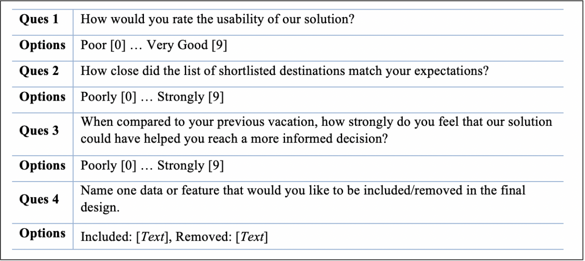
Fig 14. List of questions and options as part of Final User Survey

#### 6.3.2 Midterm and Final Survey Results

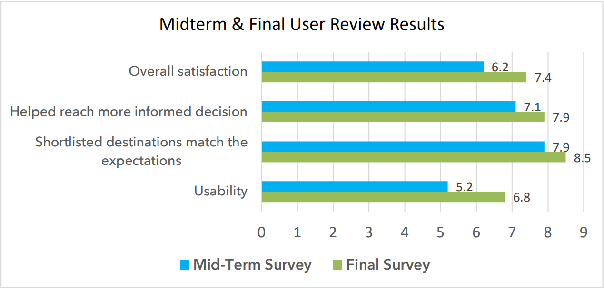
Fig 15. Survey response from the volunteers based on our solution hosted online on Amazon Web Services

#### 6.3.3 Final Survey Response Analysis
- Average scores of 7.9 on assistance in making an informed decision and 8.5 for shortlisted destinations matching expectations indicated that our intuition behind the proposed solution is extremely helpful for tourists while planning their vacations.
- However, average scores of 7.4 for overall satisfaction and 6.8 for usability were both below our expectations.
- A freeform entry in the questionnaire revealed that there is a consistent demand to include flight and hotel data for the solution to be useful. However, flight and hotel details were only available through a commercial contract and thus not included in the final version of our application.

## 7. CONCLUSION

### 7.1 The Problem

Tourism is one of the fastest growing industries, and tourists today, have access to a vast
amount of digital information distributed across the internet on commercial, public and
government travel-websites, social media-websites and personal or public blogs/forums.
Making sense of this plethora of information distributed all over the internet is challenging
for tourists due to the lack of a single unified view. Also, although the tourist websites
provide an overview of the travel destinations, the information is modelled to favour the
underlying commercial interests.

### 7.2 The Solution

To address this shortcoming, we designed an online solution (Trip Analyzer) in the form of
a website that collates travel related information from public/government/commercial
sources and presents it through an interactive and graphical interface. A preliminary survey
during the design stage was used to identify relative importance of factors or preferences to
a tourist while planning their vacations and top factors were included in our solution.
Subsequent midterm and final surveys provided a measure of overall usability, satisfaction
and relevance of our solution.

### 7.3 The Evaluation

Trip Analyzer is a novel solution and it received an overall high score from users as a tool
for research and shortlisting locations for their future vacations. However, the solution
received sub-par scores in usability and overall satisfaction due to lack of hotels/flights
information including facility to make reservations. These two features were part of our
initial design and had to be removed in the final version since this information/feature was
not available for student projects and required commercial contracts.

### 7.4 Future Scope

Trip Analyzer has successfully addressed the issue of providing tourists with an interactive
and graphical unified view of tourism related information. The solution can be extended
further as a complete vacation planner with hotels and flight bookings and a daily itinerary
planner. The solution can also be extended to take into account the current location of the
tourist and using distance/travel time as additional factors while shortlisting travel locations.

## REFERENCES

[1] Wirtz, B. W., Schilke, O., & Ullrich, S. (2010). Strategic development of business models: Implications of the web 2.0 for creating value on the internet. _Long Range Planning_ , _43_ (2-3), 272-290

[2] Standing, Craig & Tang-taye, Jean-pierre & Boyer, Michel. (2014). The Impact of the Internet in Travel and Tourism: A Research Review 2001–2010. Journal of Travel & Tourism Marketing. 31. 82-113

[3] Scott A. Cohen, Girish Prayag & Miguel Moital (2014) Consumer behaviour in tourism: Concepts, influences and opportunities, Current Issues in Tourism, 17:10, 872-909

[4] Camilleri, M. A. (2018). The Tourism Industry: An Overview. In Travel Marketing, Tourism Economics and the Airline Product (Chapter 1, pp. 3-27)

[5] Huang, Ching-Yuan & Chou, chia-jung & Lin, Pei-Ching. (2010). Involvement theory in constructing bloggers' intention to purchase travel products. Tourism Management. 31. 513-526.

[6] Brey, E. T., So, S. I., Kim, D. Y., & Morrison, A. M. (2007). Web-based permission marketing: segmentation for the lodging industry. Tourism Management, 28(6), 1408–1416

[7] Leal, Fátima & Matos Dias, Joana & Malheiro, Benedita & Burguillo, Juan. (2016). Analysis and Visualisation of Crowd-sourced Tourism Data. 98-101.

[8] Mosch, M & Frech, I & Schill, Christian & Koch, Barbara & Stelzl, H & Almer, Alexander & Schnabel, Thomas. (2004). Tourism information based on visualisation of multimedia geodata – ReGeo 

[9] Kádár, Bálint & Gede, Mátyás. (2013). Where Do Tourists Go? Visualizing and Analysing the Spatial Distribution of Geotagged Photography. Cartographica The International Journal for Geographic Information and Geovisualization. 48. 78-88.

[10] Pai, Ping-Feng & Hung, Kuo-Chen & Lin, Kuo-Ping. (2014). Tourism Demand Forecasting Using Novel Hybrid System. Expert Systems with Applications. 41. 3691–3702.

[11] Gunter, Ulrich & Onder, Irem. (2015). Forecasting international city tourism demand for Paris: Accuracy of uni- and multivariate models employing monthly data. Tourism Management. 46. 123-135.

[12] Jun, Wang & Luo, Yuyan & Lingyu, Tang & Peng, Ge. (2018). Modeling a combined forecast algorithm based on sequence patterns and near characteristics: An application for tourism demand forecasting. Chaos, Solitons & Fractals. 108. 136-147.

[13] Woodside, Arch G., and Kozak, Metin, eds. 2014. Tourists' Behaviors and Evaluations. Bingley: Emerald Publishing Limited. Accessed March 1, 2019. ProQuest Ebook Central.

[14] V. B. Joshi and R. H. Goudar, "Searching, categorizing and tour planning: A novel approach towards e-tourism," _2017 2nd IEEE International Conference on Recent Trends in Electronics, Information & Communication Technology (RTEICT)_ , Bangalore, 2017, pp. 1002 - 1005

[15] Kostas Stefanidis, Vasilis Efthymiou, Melanie Herschel, and Vassilis Christophides. 2014. Entity resolution in the web of data. In Proceedings of the 23rd International Conference on World Wide Web (WWW '14 Companion). ACM, New York, NY, USA, 203 - 204

[16] Lim, Kwan Hui & Chan, Jeffrey & Leckie, Christopher & Karunasekera, Shanika. (2018). Personalized trip recommendation for tourists based on user interests, points of interest visit durations and visit recency. Knowledge and Information Systems. 54. 375- 406

[17] Matsuo, Tokuro & Hashimoto, Kiyota & Iwamoto, Hidekazu. (2015). Tourism Informatics: Towards Novel Knowledge Based Approaches.

[18] Teare, Richard, Bowen, John, and Baloglu, Seyhmus. 2015. What is the current and future impact of social media on hospitality and tourism?. Bingley: Emerald Publishing Limited. Accessed March 2, 2019. ProQuest Ebook Central.

[19] Karapiperis, Dimitrios, Aris Gkoulalas-Divanis and Vassilios S. Verykios. “Summarization Algorithms for Record Linkage.” EDBT (2018).

[20] Mamun A-A, Aseltine R, Rajasekaran S (2016) Efficient Record Linkage Algorithms Using Complete Linkage Clustering. PLoS ONE 11(4): e0154446.